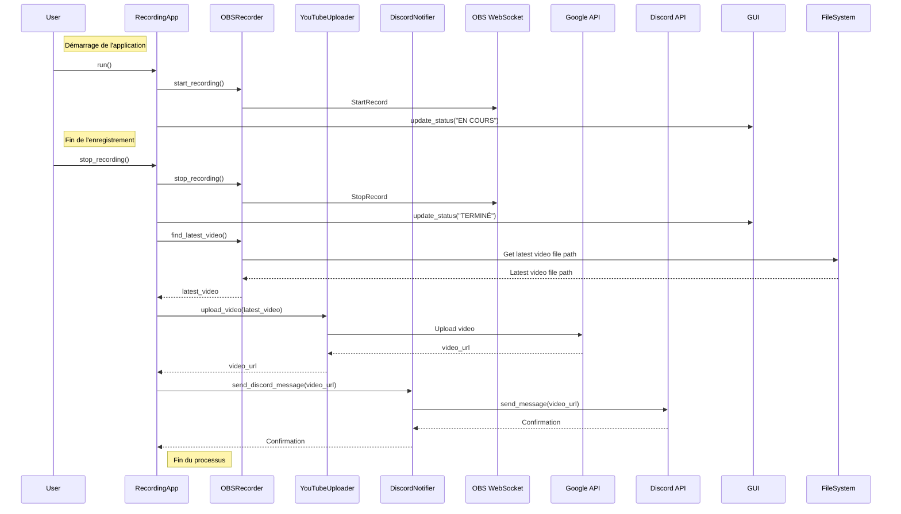

# OBS Recording and YouTube Upload Automation

## Introduction

This script is designed to automate the process of recording video using OBS Studio, uploading the recorded video to YouTube, and notifying a Discord channel with the uploaded video link. It provides a convenient way to manage recording sessions and streamline the workflow for content creators.

## Features

- **OBS Recording**: Utilizes the OBS WebSocket plugin to control recording start and stop functions programmatically.
- **YouTube Upload**: Uploads the recorded video to YouTube using the Google API.
- **Discord Notification**: Notifies a Discord channel with the URL of the uploaded video.
- **Keyboard Control**: Allows starting and stopping recording using keyboard shortcuts.
- **GUI Status Window**: Displays the current status of the recording process.
- **Live ISO Support**: Can be integrated into a live ISO environment for easy deployment. (see [build_iso.md](build_iso.md))

## Prerequisites

Before running the script, ensure you have the following:

- **OBS Studio**: Installed on your system and configured with the OBS WebSocket plugin.
- **Google API Credentials**: Obtain OAuth 2.0 credentials for the YouTube Data API. Save the `client_secret.json` file and specify its path in the environment variables.
- **Discord Bot Token**: Create a Discord bot and obtain its token for sending notifications. Specify the token in the environment variables.
- **Python Dependencies**: Install required Python packages using `pip install -r requirements.txt`.

## Environment Variables

The script utilizes environment variables for configuration. Ensure the following variables are set:

- `OBS_HOST`: Hostname or IP address of the machine running OBS Studio.
- `OBS_PORT`: Port number used by the OBS WebSocket plugin.
- `OBS_VIDEO_PATH`: Path to the directory where recorded videos are saved.
- `CLIENT_SECRETS_FILE`: Path to the `client_secret.json` file for Google API credentials.
- `TOKEN_FILE`: Path to the token file for Google API authentication.
- `DISCORD_CHANNEL_ID`: ID of the Discord channel where notifications will be sent.
- `DISCORD_BOT_TOKEN`: Token of the Discord bot for authentication.

## Usage

1. Set up the environment variables with appropriate values.
2. Run the script using Python: `python recording_app.py`.
3. Use keyboard shortcuts (`1` to start recording, `2` to stop recording, `3` to quit) to control the recording process.
4. The GUI status window will display the current status of the recording process.
5. Once recording is stopped, the video will be uploaded to YouTube, and a notification will be sent to the specified Discord channel.

## Note

- Ensure OBS Studio is running and configured correctly before executing the script.
- Handle Google API credentials and Discord bot token securely to prevent unauthorized access.

### Sequence diagram
Sequence diagram of the main workflow of the script.
