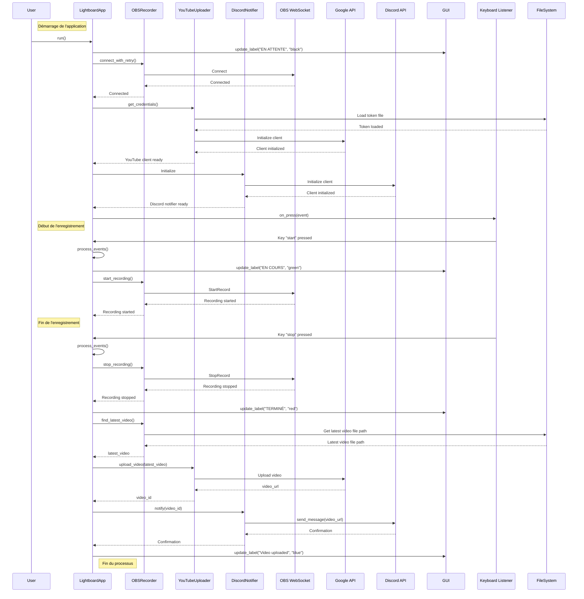

# OBS Recording and YouTube Upload Automation

## Introduction

This script is designed to automate the process of recording video using OBS Studio, uploading the recorded video to YouTube, and notifying a Discord channel with the uploaded video link. It provides a convenient way to manage recording sessions and streamline the workflow for content creators.

## Features

- **OBS Recording**: Utilizes the OBS WebSocket plugin to control recording start and stop functions programmatically (You can find OBS configuration in [`obs/`](obs/) or further explanation, please refer to the [OBS section](#obs-configuration)).
- **YouTube Upload**: Uploads the recorded video to YouTube using the Google API.
- **Discord Notification**: Notifies a Discord channel with the URL of the uploaded video.
- **Keyboard Control**: Allows starting and stopping recording using keyboard shortcuts.
- **GUI Status Window**: Displays the current status of the recording process.
- **Live ISO Support**: Can be integrated into a live ISO environment for easy deployment. (see [Build ISO section](#build-iso))

## Prerequisites

Before running the script, ensure you have the following:

- **OBS Studio**: Installed on your system and configured with the OBS WebSocket plugin.
- **Google API Credentials**: Obtain OAuth 2.0 credentials for the YouTube Data API. Save the `client_secret.json` file and specify its path in the environment variables.
- **Discord Bot Token**: Create a Discord bot and obtain its token for sending notifications. Specify the token in the environment variables.
- **Python Dependencies**: Install required Python packages using `pip install -r requirements.txt`.

## Environment Variables

The script utilizes environment variables for configuration. Ensure the following variables are set:

- `OBS_HOST`: Hostname or IP address of the machine running OBS Studio.
- `OBS_PORT`: Port number used by the OBS WebSocket plugin.
- `OBS_VIDEO_PATH`: Path to the directory where recorded videos are saved.
- `CLIENT_SECRETS_FILE`: Path to the `client_secret.json` file for Google API credentials.
- `TOKEN_FILE`: Path to the token file for Google API authentication.
- `DISCORD_CHANNEL_ID`: ID of the Discord channel where notifications will be sent.
- `DISCORD_BOT_TOKEN`: Token of the Discord bot for authentication.

Exemple .env file:
```bash
OBS_HOST="localhost"
OBS_PORT=4455
OBS_VIDEO_PATH="/home/user"

CLIENT_SECRETS_FILE="../client_secret.json"
TOKEN_FILE="../token.pkl"

DISCORD_BOT_TOKEN="your_discord_bot_token_here"
DISCORD_CHANNEL_ID="your_discord_channel_id_here"
```

## Usage

1. Set up the environment variables with appropriate values.
2. Run the script using Python: `python main.py`.
3. Use keyboard shortcuts (with an US keyboard `1` to start recording, `2` to stop recording, `3` to quit) to control the recording process.
4. The GUI status window will display the current status of the recording process.
5. Once recording is stopped, the video will be uploaded to YouTube, and a notification will be sent to the specified Discord channel.

## Note

- Ensure OBS Studio is running and configured correctly before executing the script if you are not using the custom live-cd.
- Handle Google API credentials and Discord bot token securely to prevent unauthorized access.

### Sequence diagram
Sequence diagram of the main workflow of the script.



# Build ISO

In this section, we will see how to build a custom Debian live CD that can be used to run the OBS recording script on any machine without installing any dependencies. It automatically starts the OBS and run the script that handler all the feature when the system boots up.

## File needed
To build the ISO, you need to have the following files in the root directory of the project:

- **``isolinux.cfg``**: This file is required to automatically skip the boot loader menu.
- **``start.xsession``** : Clones the git on machine startup and automatically executes the ``monscript.sh`` script commands.
- **`client_secret.json`**: Contains your Google **credentials** to upload videos to Youtube.
- **``token.pkl``** : Contains your Google **token** to upload videos to Youtube.
- **``.env``** : Store environment variables for python code.

For the `.env` file, you can create it with the following content:
You only need to change `DISCORD_BOT_TOKEN` and `DISCORD_CHANNEL_ID` with your own values.

```bash
OBS_HOST="localhost"
OBS_PORT=4455
OBS_VIDEO_PATH="/home/user"

CLIENT_SECRETS_FILE="../client_secret.json"
TOKEN_FILE="../token.pkl"

DISCORD_BOT_TOKEN="your_discord_bot_token_here"
DISCORD_CHANNEL_ID="your_discord_channel_id_here"
```

```bash
├── client_secret.json              # here
├── .env                            # here
├── .gitignore
├── live-cd
│   ├── isolinux.cfg
│   ├── lbconfig.sh
│   └── start.xsession
├── main.py
├── monscript.sh
├── obs
│   ├── obs-global-config.ini
│   ├── obs-profile-config.ini
│   └── obs-scene-config.json
├── README.md
├── requirements.txt
└── token.pkl                       # and here
```

## Debian packages required

In the [lbconfig.sh](/live-cd/lbconfig.sh) file we can found the configuration of our futur Debian live-cd. It's use to install the minimal Debian packages and copy the **`client_secret.json`**, **``token.pkl``**, **``.env``**, **``isolinux.cfg``** and **``start.xsession``** files.

The minimal packages are as follows:

- **``task-cinnamon-desktop``** : To have a desktop environnement when x11 start.
- **``obs-studio``** : To record your video.
- **``pip``** : To install python libraries.
- **``git``** : To clone this git repository.
- **``kbd``** : To use the keyboard as clip controller.
- **``python3-tk``** : To use the tinkinter python libraries.

## How to build the ISO
Then run the following commands to prepare the live directory :
```bash
cd live-cd/
./lbconfig.sh
```

After that, you can build the ISO using the following command:
```bash
cd live/
sudo lb build
```

After quite some time, you will have the ISO file in the `live-cd/live` directory.
This ISO file can now be burned to a USB stick and run on your computer. Your BIOS must be set to Legacy Boot (please refer to your mother board user manual).

## Conclusion
Great, now you have a custom live CD that can be used to run the OBS recording script on any machine without installing any dependencies. It automatically starts the OBS and run the script that handler all the feature when the system boots up.


# OBS configuration

We've specially designed 3 OBS configurations to help you get the most out of it.

Please follow these simple steps: 

- **``obs-global-config.ini``** : Rename it as ``global.ini`` and place it at ``/home/user/.config/obs-studio/global.ini`` folder.
- **``obs-profile-config.ini``** : Rename it as ``basic.ini`` and place it at ``/home/user/.config/obs-studio/basic/profiles/MyProfile/basic.ini``
- **``obs-scene-config.json``** : Rename it as ``MyScene.json`` and place it at ``/home/user/.config/obs-studio/basic/scenes/MyScene.json``
