# OBS Recording and INSA POD Upload Automation

## Introduction

This script is designed to automate the process of recording video using OBS Studio, uploading the recorded video to [POD INSA](https://videos.insa-lyon.fr), and notifying a Discord channel with the uploaded video link. It provides a convenient way to manage recording sessions and streamline the workflow for content creators. We've created a troobleshooting [file](/resources/Troubleshooting.docx) that covers some of the most common cases of failure.

## Features

- **OBS Recording**: Utilizes the OBS WebSocket plugin to control recording start and stop functions programmatically (You can find OBS configuration in [`obs/`](obs/) or further explanation, please refer to the [OBS section](#obs-configuration)).
- **INSA POD Upload**: Uploads the recorded video to POD INSA via sftp.
- **Discord Notification**: Notifies a Discord channel with the URL of the uploaded video.
- **Keyboard Control**: Allows starting and stopping recording using keyboard shortcuts.
- **GUI Status Window**: Displays the current status of the recording process.
- **Live ISO Support**: Can be integrated into a live ISO environment for easy deployment. (see [Build ISO section](#build-iso))

## Prerequisites

Before running the script, ensure you have the following:

- **OBS Studio**: Installed on your system and configured with the OBS WebSocket plugin.
- **INSA POD Credentials**: Obtain ssh private and public key from INSA POD give by DSI. Save the `id_rsa.dat` and `id_rsa.pub` at the root of the git clone.
- **Discord Bot Token**: Create a Discord bot and obtain its token for sending notifications. Specify the token in the environment variables.
- **Python Dependencies**: Install required Python packages using `sudo pip install -r requirements.txt --break-system-packages`.

## Environment Variables

The script utilizes environment variables for configuration. Ensure the following variables are set:

- `OBS_HOST`: Hostname or IP address of the machine running OBS Studio.
- `OBS_PORT`: Port number used by the OBS WebSocket plugin.
- `OBS_VIDEO_PATH`: Path to the directory where recorded videos are saved.
- `FTP_SERVER_PATH`: SFTP server address.
- `FTP_SERVER_USER`: SFTP server username 
- `FTP_SERVER_PASS_PHRASE`: SFTP pass phrase for `ìd_rsa.dat`.
- `DISCORD_WEBHOOK_URL`: Link of the Discord Webhook for authentication.

Exemple .env file:
```bash
OBS_HOST="localhost"
OBS_PORT=4455
OBS_VIDEO_PATH="/home/user"

FTP_SERVER_PATH="sftp_url"
FTP_SERVER_USER="username"
FTP_SERVER_PASS_PHRASE="yourpassphrase"

DISCORD_WEBHOOK_URL="https://discord.com/api/webhooks/yourwebhook"
```

## Usage

1. Set up the environment variables with appropriate values.
2. Run the script using Python: `sudo python main.py`.
3. Use keyboard shortcuts (with an US keyboard `1 or &` to start recording, `2 or é` to stop recording, `3 or "` to quit) to control the recording process.
4. The GUI status window will display the current status of the recording process.
5. Once recording is stopped, the video will be uploaded to YouTube, and a notification will be sent to the specified Discord channel.

## Notes

- Ensure OBS Studio is running and configured correctly before executing the script if you are not using the custom live-cd.
- Handle INSA POD credentials and Discord Webhook link securely to prevent unauthorized access.
### Flow chart of utilisation

```mermaid
flowchart TB
    classDef black fill:white,color:black;
    classDef green fill:white,color:green;
    classDef red fill:white,color:red;
    classDef blue fill:white,color:blue;

    En_attente([En attente])
    En_cours((En cours))
    Pause
    Enregistrement
    Screenshot

    En_attente:::black
    En_cours:::green
    Pause:::blue
    Enregistrement:::red
    Screenshot:::green

    En_attente --> |"Appuyer sur ⏯️"| En_cours
    En_cours --> |"Appuyer sur ⏯️"| Pause
    Pause --> |"Appuyer sur ⏯️"| En_cours

    Pause --> |"Appuyer sur 🟥"| Enregistrement
    En_cours --> |"Appuyer sur 🟥"| Enregistrement

    En_attente --> |"Appuyer sur 📷"| Screenshot
    En_cours --> |"Appuyer sur 📷"| Screenshot
    Pause --> |"Appuyer sur 📷"| Screenshot
    Enregistrement --> |"Appuyer sur 📷"| Screenshot

    %% Adding note about returning to the previous state after 3 seconds
    classDef note fill:none,stroke:none;
    note[Note: Dans l'état Screenshot, on retourne toujours à l'état précédent après 3 secondes]:::note
    Screenshot -.-> note

    %% Adding transition from Enregistrement to En_attente after 3 seconds
    Enregistrement -. "Après 3 sec" .-> En_attente
```


### User usage Sequence diagram 
Sequence diagram of the user usage.

```mermaid
sequenceDiagram
    participant Intervant & Clavier
    participant Interrupteur Mural
    participant Ordinateur
    participant Écran & Pop-up
    participant Lightboard & LED
    participant PodINSA
    participant Discord

    Note right of Intervant & Clavier: Lancement de la solution

    Intervant & Clavier ->> Interrupteur Mural: Allumer
    Interrupteur Mural ->> Ordinateur: Démarrage
    Ordinateur ->> Ordinateur: Lancement du script
    Ordinateur ->> Écran & Pop-up: Retour caméra & Pop-up
    Interrupteur Mural ->> Lightboard & LED: Démarrage
    Ordinateur ->> Écran & Pop-up: SCREENSHOT, état du tableau
    Ordinateur ->> Discord: Envoi de la capture d'écran
    Ordinateur ->> Écran & Pop-up: ATTENTE

    Note right of Intervant & Clavier: Début de l'enregistrement

    Intervant & Clavier ->> Ordinateur: Bouton vert
    Ordinateur ->> Écran & Pop-up: EN COURS : Chronomètre
    Ordinateur ->> Ordinateur: Stockage /mnt/nvme0n1

    Note right of Intervant & Clavier: Possibilité de faire des screenshot avant/pendant/après l'enregistrement

    Intervant & Clavier ->> Ordinateur: Bouton blanc
    Ordinateur ->> Écran & Pop-up: 3..2..1..SCREENSHOT
    Ordinateur ->> Discord: Envoi de la capture d'écran

    Note right of Intervant & Clavier: Pause de l'enregistrement

    Intervant & Clavier ->> Ordinateur: Bouton vert
    Ordinateur ->> Écran & Pop-up: EN COURS : Chronomètre arrêté

    Note right of Intervant & Clavier: Reprise de l'enregistrement

    Intervant & Clavier ->> Ordinateur: Bouton vert
    Ordinateur ->> Écran & Pop-up: EN COURS : reprise du Chronomètre

    Note right of Intervant & Clavier: Fin de l'enregistrement

    Intervant & Clavier ->> Ordinateur: Bouton rouge
    Ordinateur ->> Écran & Pop-up: Terminé
    Ordinateur ->> PodINSA: Publication
    Ordinateur ->> Écran & Pop-up: SCREENSHOT, état du tableau
    Ordinateur ->> Discord: Envoi de la capture d'écran

    Note right of Intervant & Clavier: Récupérer la vidéo publiée

    Intervant & Clavier ->> Discord: Accès à l'URL de PodINSA
    Ordinateur ->> Écran & Pop-up: ATTENTE

    Intervant & Clavier ->> Interrupteur Mural: Éteindre
    Intervant & Clavier ->> Lightboard & LED: Nettoyer le lightboard
```



### Sequence diagram
Sequence diagram of the main workflow of the script.

```mermaid
sequenceDiagram
    participant User
    participant LightboardApp
    participant OBSRecorder
    participant YouTubeUploader
    participant DiscordNotifier
    participant OBSWebSocket as OBS WebSocket
    participant GoogleAPI as Google API
    participant DiscordAPI as Discord API
    participant GUI
    participant Keyboard as Keyboard Listener
    participant FileSystem

    Note right of User: Démarrage de l'application

    User ->> LightboardApp: run()
    LightboardApp ->> GUI: update_label("EN ATTENTE", "black")
    LightboardApp ->> OBSRecorder: connect_with_retry()
    OBSRecorder ->> OBSWebSocket: Connect
    OBSWebSocket -->> OBSRecorder: Connected
    OBSRecorder -->> LightboardApp: Connected
    LightboardApp ->> YouTubeUploader: get_credentials()
    YouTubeUploader ->> FileSystem: Load token file
    FileSystem -->> YouTubeUploader: Token loaded
    YouTubeUploader ->> GoogleAPI: Initialize client
    GoogleAPI -->> YouTubeUploader: Client initialized
    YouTubeUploader -->> LightboardApp: YouTube client ready
    LightboardApp ->> DiscordNotifier: Initialize
    DiscordNotifier ->> DiscordAPI: Initialize client
    DiscordAPI -->> DiscordNotifier: Client initialized
    DiscordNotifier -->> LightboardApp: Discord notifier ready
    LightboardApp ->> Keyboard: on_press(event)

    Note right of User: Début de l'enregistrement

    Keyboard ->> LightboardApp: Key "start" pressed
    LightboardApp ->> LightboardApp: process_events()
    LightboardApp ->> GUI: update_label("EN COURS", "green")
    LightboardApp ->> OBSRecorder: start_recording()
    OBSRecorder ->> OBSWebSocket: StartRecord
    OBSWebSocket -->> OBSRecorder: Recording started
    OBSRecorder -->> LightboardApp: Recording started

    Note right of User: Fin de l'enregistrement

    Keyboard ->> LightboardApp: Key "stop" pressed
    LightboardApp ->> LightboardApp: process_events()
    LightboardApp ->> OBSRecorder: stop_recording()
    OBSRecorder ->> OBSWebSocket: StopRecord
    OBSWebSocket -->> OBSRecorder: Recording stopped
    OBSRecorder -->> LightboardApp: Recording stopped
    LightboardApp ->> GUI: update_label("TERMINÉ", "red")
    LightboardApp ->> OBSRecorder: find_latest_video()
    OBSRecorder ->> FileSystem: Get latest video file path
    FileSystem -->> OBSRecorder: Latest video file path
    OBSRecorder -->> LightboardApp: latest_video
    LightboardApp ->> YouTubeUploader: upload_video(latest_video)
    YouTubeUploader ->> GoogleAPI: Upload video
    GoogleAPI -->> YouTubeUploader: video_url
    YouTubeUploader -->> LightboardApp: video_id
    LightboardApp ->> DiscordNotifier: notify(video_id)
    DiscordNotifier ->> DiscordAPI: send_message(video_url)
    DiscordAPI -->> DiscordNotifier: Confirmation
    DiscordNotifier -->> LightboardApp: Confirmation
    LightboardApp ->> GUI: update_label("Video uploaded", "blue")

    Note right of LightboardApp: Fin du processus
```


# Build ISO

In this section, we will see how to build a custom Debian live CD that can be used to run the OBS recording script on any machine without installing any dependencies. It automatically starts the OBS and run the script that handler all the feature when the system boots up.

## File needed
To build the ISO, you need to have the following files:

- **``isolinux.cfg``**: This file is required to automatically skip the boot loader menu.
- **``start.xsession``** : Clones ***this*** git on machine startup and automatically executes the ``monscript.sh`` script commands.
- **``id_rsa.dat``**: SSH ***private*** key to connect to POD INSA SFTP server.
- **``id_rsa.pub``** : SSH ***public*** key to connect to POD INSA SFTP server.
- **``.env``** : Store environment variables for python code.

For the `.env` file, you can create it with the following content:
You need to change `FTP_SERVER_PATH`, `FTP_SERVER_USER`, `FTP_SERVER_PASS_PHRASE` and `DISCORD_WEBHOOK_URL` with your own values.

```bash
OBS_HOST="localhost"
OBS_PORT=4455
OBS_VIDEO_PATH="/home/user"

FTP_SERVER_PATH="sftp_url"
FTP_SERVER_USER="username"
FTP_SERVER_PASS_PHRASE="yourpassphrase"

DISCORD_WEBHOOK_URL="https://discord.com/api/webhooks/yourwebhook"
```

```bash
├── .env                # here
├── .gitignore
├── id_rsa.dat          # here
└── id_rsa.pub          # here
├── live-cd
│   ├── isolinux.cfg    # here
│   ├── lbconfig.sh
│   └── start.xsession  # and here
├── main.py
├── monscript.sh
├── obs
│   ├── obs-global-config.ini
│   ├── obs-profile-config.ini
│   └── obs-scene-config.json
├── README.md
├── requirements.txt
```

## Debian packages required

In the [lbconfig.sh](/live-cd/lbconfig.sh) file we can found the configuration of our futur Debian live-cd. It's use to install the minimal Debian packages and copy the **`id_rsa.dat`**, **``id_rsa.pub``**, **``.env``**, **``isolinux.cfg``** and **``start.xsession``** files.

The minimal packages are as follows:

- **``task-cinnamon-desktop``** : To have a desktop environnement when x11 start.
- **``obs-studio``** : To record your video.
- **``pip``** : To install python libraries.
- **``git``** : To clone this git repository.
- **``kbd``** : To use the keyboard as clip controller.
- **``python3-tk``** : To use the tinkinter python libraries.

## How to build the ISO
Then run the following commands to prepare the live directory :
```bash
cd live-cd/
sh ./lbconfig.sh
```

After that, you can build the ISO using the following command:
```bash
cd live/
sudo lb build
```

After quite some time, you will have the ISO file name `live-image-amd64.hybrid.iso` in the `live-cd/live` directory.
This ISO file can now be burned to a USB stick and run on your computer. Your BIOS must be set to Legacy Boot (please refer to your mother board user manual).

## Conclusion
Great, now you have a custom live CD that can be used to run the OBS recording script on any machine without installing any dependencies. It automatically starts the OBS and run the script that handler all the feature when the system boots up.


# OBS configuration

We've specially designed 3 OBS configurations to help you get the most out of it.

Please follow these simple steps: 

- **``obs-global-config.ini``** : Rename it as ``global.ini`` and place it at ``/home/user/.config/obs-studio/global.ini`` folder.
- **``obs-profile-config.ini``** : Rename it as ``basic.ini`` and place it at ``/home/user/.config/obs-studio/basic/profiles/MyProfile/basic.ini``
- **``obs-scene-config.json``** : Rename it as ``MyScene.json`` and place it at ``/home/user/.config/obs-studio/basic/scenes/MyScene.json``
